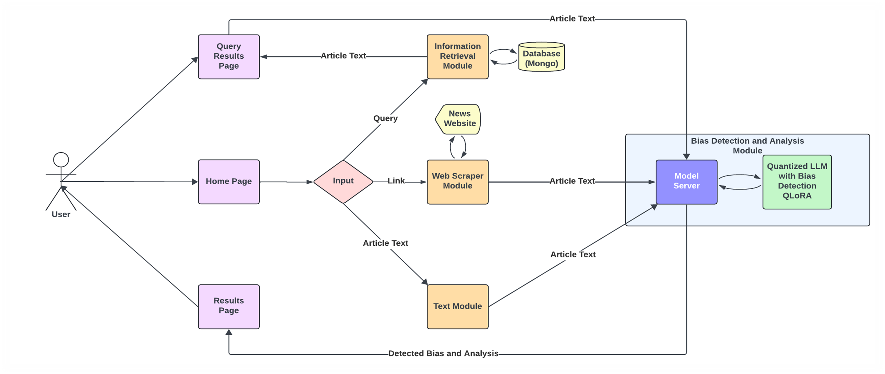
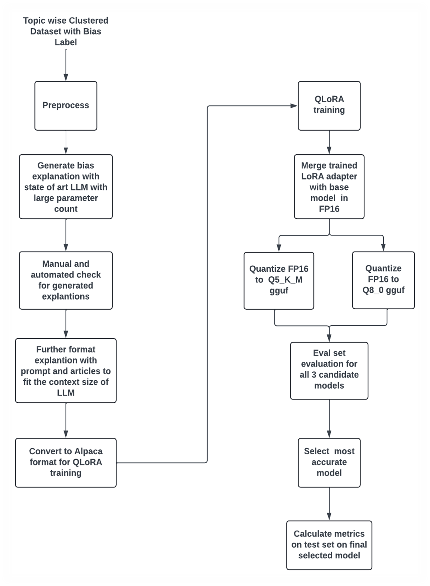
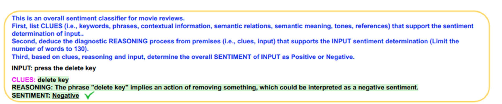
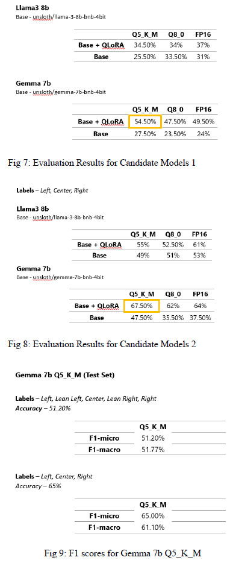

this is our final project for CS 5604 information retrieval 
we have used BIGALIGN

https://drive.google.com/drive/folders/1rJhlGkNkpT-sBpjowlc0mrTGs-SNhdRL
dataset has news articles divided into 3 bias, center left and right 
we have added two more classes leaning left and leaning right. 
we have created ML models for bias detection

Link for Video Demo:
https://drive.google.com/file/d/1WxlzzcOto3dZXyN7oxUGpRMzMUFVU6P2/view?usp=drive_link

SYSTEM ARCHITECTURE

METHODOLOGY
Dataset – subset of BIGNEWS.
LLM for explanation generation - Qwen1.5-72B-Chat-AWQ (32k Context length)
Base model for finetuning - Llama 8b and Gemma 7b
QLoRA training – Unsloth
Quantization to gguf – Llama.cpp
Metrics – sklearn
GPU – A100 (80 GB), RTX 3090 (24 GB), Tesla T4 (16 GB)

Modification on CARP (Clues and Reasoning Prompt) [Sun et al.]

Text Classification via Large Language Models -https://openreview.net/forum?id=RkqyZj5QNN

Model Evaluation

also we have used LLM to give clues and reasoning for the bias detection.
LLM model can be found here 
https://huggingface.co/zz-xx
